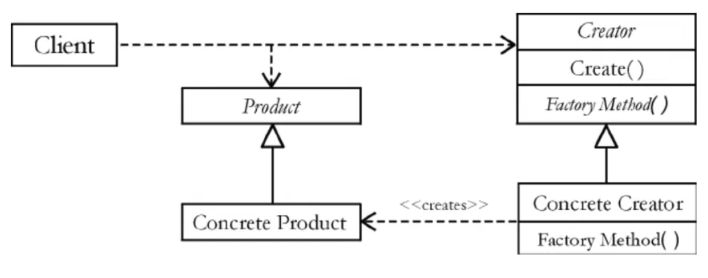
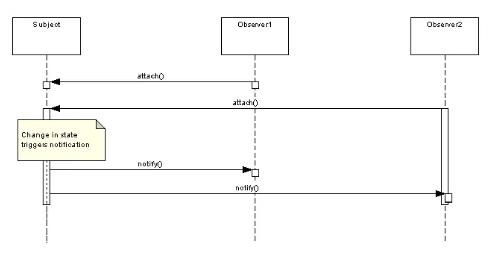
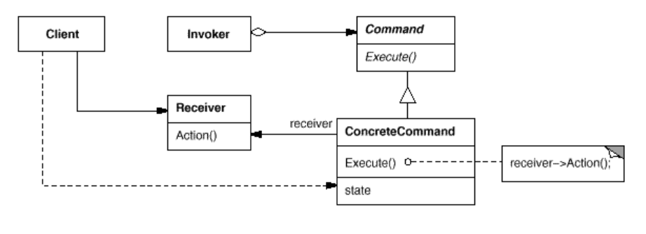

# Low-Level Design patterns
Low-Level Design (LLD) patterns in Java can elevate your code from functional to phenomenal. 
This examples explores 10 essential Java LLD patterns, each with practical insights and examples to help you write cleaner, 
more maintainable code. Whether you’re building a small app or a large system, these patterns will streamline your development process and showcase your skills.

1. Singleton Pattern for Resource Control
- This pattern ensures a class has only one instance and provides a global point of access to it, 
perfect for managing shared resources like database connections. 
It prevents resource wastage and ensures consistent access across your application. Use it wisely to avoid overcomplicating simple classes.
<br> [Singleton Pattern Example](src/main/java/com/xmacedo/singleton/SingletonExample.java)
---
2. Factory Pattern for Flexible Object Creation
- This pattern delegates object creation to a dedicated factory class, making your code more flexible and easier to extend. 
It’s ideal when you need to create objects based on conditions, like choosing a payment processor. This pattern reduces tight coupling and simplifies maintenance.
<br> [Factory Pattern Example](src/main/java/com/xmacedo/factory/FactoryExample.java)
  
This factory creates the right processor based on input, keeping client code clean.



Diagram: Factory Pattern Structure
```
   +--------+       +-----------------+
   | Client | ----> | PaymentFactory  |
   +--------+       +-----------------+
                           |
                           v
             +-----------------------------+
             | PaymentProcessor Interface  |
             +-----------------------------+
                    ^               ^
                    |               |
         +----------------+   +----------------+
         | CreditCardProc |   | PayPalProcessor |
         +----------------+   +----------------+
```
Caption: Visualizing how the Factory pattern delegates object creation.

---
3. Builder Pattern for Complex Objects
- This pattern simplifies constructing objects with many optional fields, like a user profile with varying attributes. 
It improves readability and avoids constructor bloat. Use it for objects requiring step-by-step configuration.
<br> [Builder Patterrn Example](src/main/java/com/xmacedo/builder/BuilderExample.java)

---
4. Strategy Pattern for Swappable Behaviors
- The Strategy pattern lets you define a family of algorithms and swap them at runtime, like sorting methods for a dataset. 
It promotes flexibility and reusability, making your code easier to modify without changing core logic.
<br> [Strategy Pattern Example](src/main/java/com/xmacedo/strategy/StrategyExample.java)

This allows switching sorting algorithms without altering DataProcessor.

---
5. Observer Pattern for Event Handling
- The Observer pattern enables objects to listen for changes in another object’s state, ideal for event-driven systems like UI updates. 
It decouples components, making your system more modular. Be cautious of memory leaks with long-lived observers.
<br> [Observer Pattern Example](src/main/java/com/xmacedo/observer/ObserverExample.java)

This notifies traders when stock prices change.



---

6. Decorator Pattern for Flexible Enhancements
- The Decorator pattern adds functionality to objects dynamically, like adding logging to a service. 
It’s a cleaner alternative to subclassing for extending behavior. Use it when you need optional features without modifying core classes.
<br>[Decorator Pattern Example](src/main/java/com/xmacedo/decorator/DecoratorExample.java)

This adds logging without altering **_BasicService_**.

---

7. Adapter Pattern for Compatibility
- The Adapter pattern bridges incompatible interfaces, like integrating a legacy system with a modern API.
<br> [Legacy Pattern Example](src/main/java/com/xmacedo/adapter/AdapterExample.java)

This makes the legacy system compatible with the modern API.

It ensures seamless communication between components, saving time on rewrites. Always document adapters clearly to avoid confusion.

---

8. Command Pattern for Action Encapsulation
- The Command pattern encapsulates actions as objects, enabling undoable operations or queued tasks, like a task scheduler. 
It decouples the requester from the executor, improving flexibility. Use it for operations requiring history or replay.
<br> [Command Pattern Example](src/main/java/com/xmacedo/command/CommandExample.java)

This encapsulates tasks for flexible execution.



### Diagram: Command Pattern Flow
```
   +---------+       +---------+       +---------+
   | Invoker | ----> | Command | ----> | Receiver|
   +---------+       +---------+       +---------+
          |               ^                 |
          +---------------+-----------------+
                     execute()
```

---


9. Facade Pattern for Simplified Interfaces
The Facade pattern provides a simplified interface to a complex subsystem, like a library with multiple modules. 
It reduces complexity for clients and improves usability. Ensure the facade doesn’t become a bloated catch-all.
<br> [Facade Example](src/main/java/com/xmacedo/facade/FacadeExample.java)

This simplifies the order process for clients.

10. Template Method Pattern for Reusable Algorithms
- The Template Method pattern defines a skeleton for an algorithm, allowing subclasses to customize steps, 
like a report generator. 
It ensures consistency while allowing flexibility. Use it for processes with fixed steps but variable details.
<br> [Template Method Example](src/main/java/com/xmacedo/template_method/TemplateMethodExample.java)
